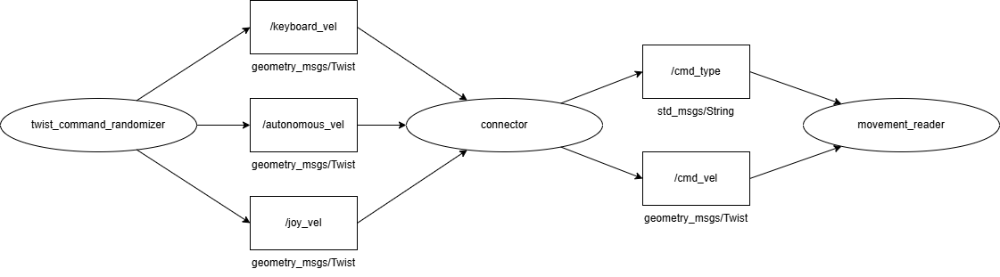

# Milestone 2 Tugas Besar 1 Ca-KRAI 
> Ca-KRAI Kru 17 Divisi Control

## Bonus
Bonus yang dikerjakan adalah kedua bonus pada spesifikasi, yakni bonus pertama (terkait config dan launch file) dan bonus kedua (terkait subscribing ke 3 topic).

## Dependencies
Package ini dibuat menggunakan [ROS2 Humble](https://docs.ros.org/en/humble/index.html). Selain itu, program Node ditulis dalam bahasa [Python](https://www.python.org/) versi 3.10+.

## Penjelasan Node
Node  `connector` meng-subscribe kepada tiga topic, yakni `/joy_vel`, `/autonomous_vel`, dan `/keyboard_vel`. Node ini menggunakan priority queue untuk menentukan 
prioritas message yang akan di-publish dari ketiga topic tersebut (pada implementasi ini, prioritasnya adalah: joy > keyboard > autonomous). Untuk memastikan tidak ada
kesalahan dalam memasukkan message ke dalam prioqueue dan saat publishing, node ini memanfaatkan mutex lock agar tidak terjadi race condition yang mencampur-aduk nilai yang ingin
dimasukkan ke dalam prioqueue. Nilai yang dimasukkan ke dalam prioqueue berupa sebuah tuple berisi tipe data yang diterima dan nilai Twist data tersebut. Terakhir, node `connector`
melakukan publish ke dua topic, yaitu `/cmd_vel` yang menggunakan nilai Twist data yang diterima dan `/cmd_type` yang menggunakan tipe data tersebut, secara bersamaan. 

Publish rate node ini sama seperti publish rate node `twist_command_randomizer`, yakni 5 Hz (dapat dilihat pada file config).

## Memulai Program
Pertama, silakan clone repository ini pada ROS2 workspace Anda.
```sh
git clone https://github.com/TukangLas21/ms2-tb1-cakrai17-13523112.git
```

Lalu, build package pada workspace Anda.
```sh
colcon build --symlink-install
source install/setup.bash
```

Kemudian, jalankan Node dengan menjalankan launch file yang terdapat pada package ini.
```sh
ros2 launch pkg_13523112 connector.launch.py
```

Sebagai alternatif, Anda juga dapat menjalankan Node ini sendiri dengan perintah:
```sh
ros2 run pkg_13523112 connector.py
```

Terakhir, silakan jalankan package `magang_2025` dengan perintah di bawah ini (pastikan package berada pada workspace yang sama).
```sh
ros2 launch magang_2025 milestone2.launch.py
```
